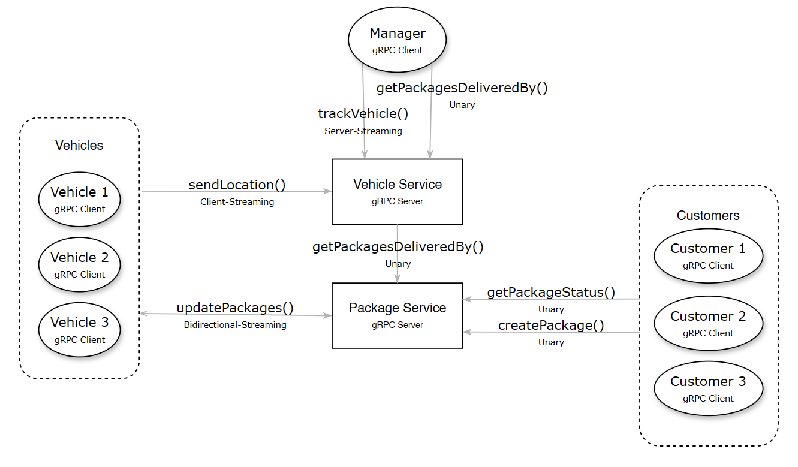

# gRPC w C++ z użyciem OTel

## Wysokowydajny, uniwersalny framework RPC typu open source

## Autorzy (rok 2025, grupa 9:45 czwartek)
- Patryk Czuchnowski
- Michał Pędrak
- Andrzej Wacławik
- Ivan Zarzhitski

## Wprowadzenie

W ramach projektu, budujemy prostą aplikację typu klient-serwer opartą o [gRPC](https://www.cncf.io/projects/grpc/) z włączoną instrumentacją danych telemetrycznych (śladów, metryk, logów prowadzonej komunikacji) przy wykorzystaniu [OpenTelemetry](https://www.cncf.io/projects/opentelemetry/). Dzięki wykorzystaniu OTLP (czyli protokołu OpenTelemetry), zebrane dane będą mogły być eksportowane do narzędzi wizualizacyjnych takich jak [Grafana](https://grafana.com/).

Celem projektu jest stworzenie aplikacji, która nie tylko umożliwia komunikację pomiędzy klientem a serwerem za pomocą gRPC, ale również zapewnia pełną obserwowalność działania systemu, czyli zdolność do zrozumienia, co dzieje się wewnątrz niego, na podstawie zewnętrznych sygnałów (danych telemetrycznych). Dzięki integracji z OpenTelemetry, aplikacja będzie monitorowana pod kątem wydajności oraz dostępności, co pozwoli na szybsze wykrywanie ewentualnych problemów.

## Podstawy teoretyczne i stos technologiczny

Framework gRPC to nowoczesny i wydajny system typu open source do zdalnego wywoływania procedur, który może działać w niemalże dowolnym środowisku. Umożliwia efektywne łączenie usług zarówno wewnątrz, jak i pomiędzy centrami danych, oferując możliwość podłączania modułów do obsługi równoważenia obciążenia, śledzenia danych telemetrycznych czy uwierzytelniania. 

OpenTelemetry to standard i zestaw narzędzi typu open source, służący do zbierania, przetwarzania i eksportowania danych telemetrycznych z aplikacji, takich jak metryki, logi, ślady i profile. Jest on rozwijany przez Cloud Native Computing Foundation (CNCF) i ma na celu ujednolicenie sposobu obserwowalności systemów rozproszonych.

OTLP (OpenTelemetry Protocol) to standaryzowany protokół komunikacyjny używany przez OpenTelemetry do przesyłania danych telemetrycznych między aplikacjami do obserwowalności (takimi jak Grafana, Jaeger, Prometheus). Jest on binarnym protokołem opartym na gRPC lub [HTTP/Protobuf](https://protobuf.dev/).

W ramach projektu, wykorzystujemy technologię gRPC do komunikacji, OpenTelemetry do zbierania danych telemetrycznych. Protokół OTLP jest używany do eksportowania zebranych danych telemetrycznych do narzędzia Grafana, służącego do wizualizacji wyników. Projekt zostanie skonteneryzowany za pomocą Kubernetes oraz zdeployowany na AWS.

## Opis koncepcji

W ramach projektu stworzymy system zarządzania flotą pojazdów i przesyłkami w architekturze rozproszonej. Kluczową rolę odgrywa w nim komunikacja między niezależnymi usługami oraz monitorowanie stanu systemu i jego komponentów w czasie rzeczywistym.

## Architektura rozwiązania



Architektura systemu została przedstawiona na powyższym diagramie. System składa się z następujących komponentów:

### **Vehicle Service** (gRPC serwer) 
Odpowiada za zarządzanie lokalizacją pojazdów.

-   **sendLocation()** – Client-Streaming  
Wywoływana przez pojazdy, pojazd wysyła strumień danych z lokalizacją do serwera.

-   **trackVehicle()** – Server-Streaming  
Menedżer otrzymuje ciągły strumień lokalizacji wskazanego pojazdu.

-   **getPackagesDeliveredBy()** – Unary  
Zwraca ile paczek zostało dostarczonych przez podany pojazd w danym dniu.

### **Package Service (gRPC serwer)** 
Zarządza paczkami i udostępnia informacje o nich klientom.

-   **updatePackages()** – Bidirectional-Streaming  
Dwukierunkowa komunikacja z pojazdem, pojazd wysyła aktualizacje statusu przesyłek, serwer odpowiada jaką paczkę dostarczyć następnie i gdzie.

-   **createPackage()** – Unary  
Wywoływana przez klienta, tworzy nową paczkę do dostarczenia – z adresem nadawcy, odbiorcy itp.

-   **getPackageStatus()** – Unary  
Wywoływana przez klienta, zwraca aktualny status paczki.

### **Pojazdy (gRPC klienci)** 
Wysyłają dane lokalizacyjne i aktualizują informacje o dostawach.

### **Menedżer (gRPC klient)** 
Może śledzić lokalizację wybranego pojazdu oraz w celu monitorowania wydajności wysyła zapytania do serwisu ile dany pojazd dostarczył paczek.

### **Klienci (gRPC klienci)** 
Tworzą i śledzą przesyłki.

### **Dane telemetryczne**
Dzięki OpenTelemetry, komponenty gromadzą dane, które są następnie przesyłane przez OTLP w celu eksportu do narzędzia Grafana, która umożliwia wizualizację i monitorowanie aplikacji w czasie rzeczywistym. 

## Opis konfiguracji środowiska

Projekt został przygotowany w języku **C++** z wykorzystaniem frameworka **gRPC** oraz instrumentacji **OpenTelemetry**. Do jego uruchomienia wymagane są:

- **Docker** w wersji 20.10 lub nowszej,
- **g++** i **make** (opcjonalnie – tylko w przypadku lokalnej kompilacji poza Dockerem),
- Narzędzia do wizualizacji danych telemetrycznych, np. **Grafana** z **Tempo** i **Prometheus** (opcjonalnie).
- **kind** do lokalnego uruchomienia aplikacji na klastrze Kubernetes

### Struktura środowiska:

- Każdy komponent (np. `vehicle-service`, `customer-client`) posiada własny plik `Dockerfile`.
- Pliki `.yaml` (`vehicle-client.yaml`, `package-service.yaml` itd.) zawierają definicje uruchomieniowe (dla Kubernetesa).
- Skrypty `build_base_docker_image.sh` oraz `build_docker_images.sh` służą do automatycznej budowy obrazów Dockerowych.
- Skrypt `deploy_kind.sh` służy do automatycznego deploymentu do lokalnego klastra `kind`
- Katalog `src/` zawiera kod źródłowy w C++ oraz pliki `.proto` definiujące interfejsy gRPC.

## Metoda instalacji

Instalacja projektu polega na budowie obrazów Dockerowych i ich uruchomieniu. Poniżej przedstawiono kroki wymagane do przygotowania środowiska:

### Krok 1: Budowa środowiska i import niezbędnych bibliotek

```bash
cd app
./build_base_docker_image.sh
```
### Krok 2: Budowa wszystkich obrazów komponentów
```bash
./build_docker_images.sh
```

Ten skrypt tworzy obrazy dla:
- `vehicle-service`
- `vehicle-client`
- `package-service`
- `manager-client`
- `customer-client`

### Krok 3: (Opcjonalnie) Budowa pojedynczego obrazu
Można zbudować pojedynczą usługę ręcznie:
```bash
docker build -f Dockerfile.vehicle-service -t suu/vehicle-service .
```

### Krok 4: Uruchomienie usług
Można uruchomić kontenery ręcznie lub wykorzystać pliki `.yaml` i środowisko Kubernetes (np. `kind`, `minikube` lub chmurę).

Przykład użycia `kubectl`:
```bash
kubectl apply -f vehicle-service.yaml
```
Lub uruchomienie w trybie developerskim przy użyciu `docker run`.

Stworzyliśmy również skrypt `deploy_kind.sh` który automatycznie deployuje obrazy Dockerowe do klastra `kind`.

```bash
./deploy_kind.sh
```

## Uruchamianie projektu - krok po kroku

### Podejście Infrastructure as Code

## Etapy uruchomienia demonstracyjnego

### Konfiguracja środowiska testowego

### Przygotowanie danych testowych

### Uruchomienie aplikacji

### Prezentacja wyników działania


## Wykorzystanie AI w projekcie

## Podsumowanie i wnioski

## Odniesienia

- [gRPC website](https://www.cncf.io/projects/grpc/)
- [OpenTelemetry website](https://www.cncf.io/projects/opentelemetry/)
- [Grafana tools website](https://grafana.com/)
- [Protobuf website](https://protobuf.dev/)
