# gRPC w C++ z użyciem OTel

## Wysokowydajny, uniwersalny framework RPC typu open source

## Autorzy (rok 2025, grupa 9:45 czwartek)
- Patryk Czuchnowski
- Michał Pędrak
- Andrzej Wacławik
- Ivan Zarzhitski

## Wprowadzenie

W ramach projektu zbudowaliśmy aplikację mikroserwisową opartą o [gRPC](https://www.cncf.io/projects/grpc/) z włączoną instrumentacją danych telemetrycznych (śladów, metryk, logów prowadzonej komunikacji) przy wykorzystaniu [OpenTelemetry](https://www.cncf.io/projects/opentelemetry/). Dzięki wykorzystaniu OTLP (czyli protokołu OpenTelemetry), zebrane dane będą mogły być eksportowane do narzędzi wizualizacyjnych takich jak [Grafana](https://grafana.com/).

Celem projektu jest stworzenie aplikacji, która nie tylko umożliwia komunikację pomiędzy klientem a serwerem za pomocą gRPC, ale również zapewnia pełną obserwowalność działania systemu, czyli zdolność do zrozumienia, co dzieje się wewnątrz niego, na podstawie zewnętrznych sygnałów (danych telemetrycznych). Dzięki integracji z OpenTelemetry, aplikacja będzie monitorowana pod kątem wydajności oraz dostępności, co pozwoli na szybsze wykrywanie ewentualnych problemów.

## Podstawy teoretyczne i stos technologiczny

Framework gRPC to nowoczesny i wydajny system typu open source do zdalnego wywoływania procedur, który może działać w niemalże dowolnym środowisku. Umożliwia efektywne łączenie usług zarówno wewnątrz, jak i pomiędzy centrami danych, oferując możliwość podłączania modułów do obsługi równoważenia obciążenia, śledzenia danych telemetrycznych czy uwierzytelniania. 

OpenTelemetry to standard i zestaw narzędzi typu open source, służący do zbierania, przetwarzania i eksportowania danych telemetrycznych z aplikacji, takich jak metryki, logi, ślady i profile. Jest on rozwijany przez Cloud Native Computing Foundation (CNCF) i ma na celu ujednolicenie sposobu obserwowalności systemów rozproszonych.

OTLP (OpenTelemetry Protocol) to standaryzowany protokół komunikacyjny używany przez OpenTelemetry do przesyłania danych telemetrycznych między aplikacjami do obserwowalności (takimi jak Grafana, Jaeger, Prometheus). Jest on binarnym protokołem opartym na gRPC lub [HTTP/Protobuf](https://protobuf.dev/).

W ramach projektu, wykorzystujemy technologię gRPC do komunikacji, OpenTelemetry do zbierania danych telemetrycznych. Protokół OTLP jest używany do eksportowania zebranych danych telemetrycznych do narzędzia Grafana, służącego do wizualizacji wyników. Projekt jest skonteneryzowany za pomocą Kubernetes oraz zdeployowany na kind.

Dane telemetryczne są agregowane i przetwarzane przez komponent OpenTelemetry Collector, który umożliwia integrację z różnymi backendami oraz konwersję i filtrowanie danych.

Do zbierania i przeglądania logów wykorzystujemy Loki, lekki system do agregacji logów stworzony przez Grafana Labs.

Metryki aplikacyjne są zbierane przez Prometheus, który następnie eksportuje je do Grafany w celu ich wizualizacji.

Ślady rozproszone są przechowywane i analizowane za pomocą Tempo, systemu śledzenia opartego na OpenTelemetry.

Do prezentacji metryk, logów i śladów wykorzystujemy Grafana, elastyczne narzędzie do tworzenia interaktywnych dashboardów i analiz danych telemetrycznych w czasie rzeczywistym.

## Opis koncepcji

W ramach projektu stworzyliśmy system zarządzania flotą pojazdów i przesyłkami w architekturze rozproszonej.

## Architektura rozwiązania


Architektura systemu została przedstawiona na powyższym diagramie. System składa się z następujących komponentów:

### **Vehicle Service** (gRPC serwer) 
Odpowiada za zarządzanie lokalizacją pojazdów.

-   **sendLocation()** – Client-Streaming  
Wywoływana przez pojazdy, pojazd wysyła strumień danych z lokalizacją do serwera.

-   **trackVehicle()** – Server-Streaming  
Menedżer otrzymuje ciągły strumień lokalizacji wskazanego pojazdu.

-   **getPackagesDeliveredBy()** – Unary  
Zwraca ile paczek zostało dostarczonych przez podany pojazd w danym dniu.

### **Package Service (gRPC serwer)** 
Zarządza paczkami i udostępnia informacje o nich klientom.

-   **updatePackages()** – Bidirectional-Streaming  
Dwukierunkowa komunikacja z pojazdem, pojazd wysyła aktualizacje statusu przesyłek, serwer odpowiada jaką paczkę dostarczyć następnie i gdzie.

-   **createPackage()** – Unary  
Wywoływana przez klienta, tworzy nową paczkę do dostarczenia – z adresem nadawcy, odbiorcy itp.

-   **getPackageStatus()** – Unary  
Wywoływana przez klienta, zwraca aktualny status paczki.

### **Pojazdy (gRPC klienci)** 
Wysyłają dane lokalizacyjne i aktualizują informacje o dostawach.

### **Menedżer (gRPC klient)** 
Może śledzić lokalizację wybranego pojazdu oraz w celu monitorowania wydajności wysyła zapytania do serwisu ile dany pojazd dostarczył paczek.

### **Klienci (gRPC klienci)** 
Tworzą i śledzą przesyłki.

### **Dane telemetryczne**
Dzięki OpenTelemetry, serwisy gromadzą dane, które są następnie przesyłane do OpenTelemetry Collectora. Następnie metryki są odczytywane przez Prometheusa, logi są eksportowane do Loki, a tracy do Tempo. Następnie można dodać je jako DataSource do Grafany, która umożliwia wizualizację i monitorowanie aplikacji w czasie rzeczywistym. 

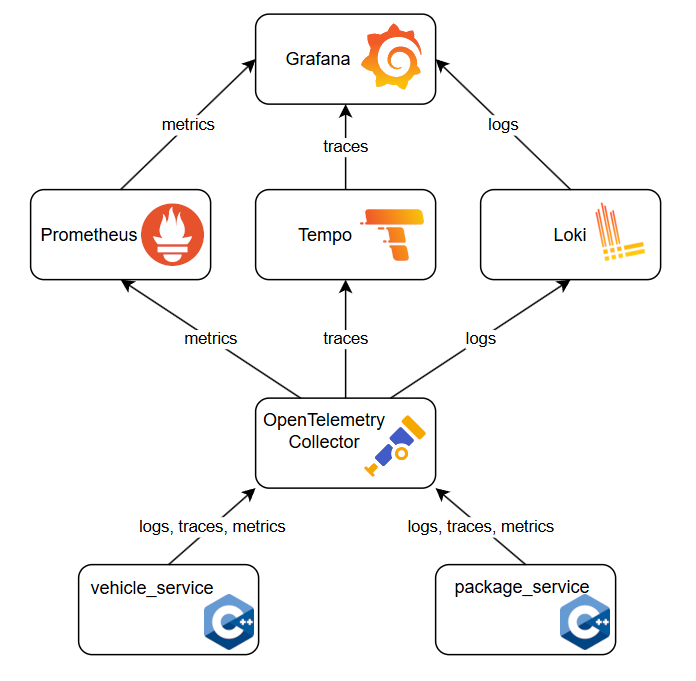

## Opis konfiguracji środowiska

Projekt został przygotowany w języku **C++** z wykorzystaniem frameworka **gRPC** oraz instrumentacji **OpenTelemetry**. Do jego uruchomienia wymagane są:

- **Docker** w wersji 20.10 lub nowszej,
- **kind** do lokalnego uruchomienia aplikacji na klastrze Kubernetes,
- **kubectl** do zarządzania klastrem Kubernetes z linii komend,
- **helm** do automatyzacji wdrożenia usług takich jak Grafana, Tempo, Loki oraz Prometheus

oraz opcjonalnie w przypadku lokalnej kompilacji poza Dockerem

- **g++** i **make**.

### Struktura środowiska:

- Każdy komponent (np. `vehicle-service`, `customer-client`) posiada własny plik `Dockerfile`.
- Pliki `.yaml` (`vehicle-client.yaml`, `package-service.yaml` itd.) zawierają definicje uruchomieniowe (dla Kubernetesa).
- Skrypty `build_base_docker_image.sh` oraz `build_docker_images.sh` służą do automatycznej budowy obrazów Dockerowych.
- Skrypt `deploy_kind.sh` służy do automatycznego deploymentu do lokalnego klastra `kind`
- Katalog `src/` zawiera kod źródłowy w C++ oraz pliki `.proto` definiujące interfejsy gRPC.

## Metoda instalacji

Instalacja projektu polega na budowie obrazów Dockerowych i ich uruchomieniu. Poniżej przedstawiono kroki wymagane do przygotowania środowiska:

### Krok 1: Budowa środowiska i import niezbędnych bibliotek

```bash
cd app
./build_base_docker_image.sh
```

### Krok 2: Budowa wszystkich obrazów komponentów

```bash
./build_docker_images.sh
```

Ten skrypt tworzy obrazy dla:
- `vehicle-service`
- `vehicle-client`
- `package-service`
- `manager-client`
- `customer-client`

#### (Alternatywnie) 

Można zbudować pojedynczą usługę ręcznie poprzez budowę pojedynczego obrazu:

```bash
docker build -f Dockerfile.vehicle-service -t suu/vehicle-service .
```

### Krok 3: Uruchomienie usług

Użycie programu `kind` do uruchomienia poprzez gotowy skrypt `deploy_kind.sh`

```bash
./deploy_kind.sh
```

#### (Alternatywnie)

Można uruchomić kontenery ręcznie lub wykorzystać pliki `.yaml` i środowisko Kubernetes (np. `kind`, `minikube` lub chmurę).

Przykład użycia `kubectl`:

```bash
kubectl apply -f vehicle-service.yaml
```

Lub uruchomić w trybie developerskim przy użyciu `docker run`.


## Uruchamianie projektu – krok po kroku

1. **Wymagania wstępne**

   - Zainstalowane narzędzia:
     - `Docker`
     - `kind` 
     - `kubectl`
     - `helm`
   - Otwarty dostęp do portów 3000 (Grafana), 9090 (Prometheus)

2. **Budowanie obrazów Dockera, bazowego oraz aplikacji**

```bash
cd app
./build_base_docker_image.sh
./build_docker_images.sh
```

3. **Uruchomienie klastra i komponentów**

```bash
kind create cluster
./deploy_kind.sh
```

4. **Uruchomienie OTEL collectora oraz Grafany**

```bash
./deploy_otel_collector.sh
./deploy_grafana.sh
```

- (Opcjonalne) Skrypty do usunięcia deploymentów:

```bash
./remove_deployments.sh
./remove_default_namespace_deployments.sh
```

5. **Weryfikacja wdrożenia poprzez użycie `kubectl` do sprawdzenia stanu podów**

- wszystkie przestrzenie nazw na raz

```bash
kubectl get pods --all-namespaces
```

- lub każda osobno
 ```bash
kubectl get pods
kubectl get pods --namespace loki
kubectl get pods --namespace prometheus
kubectl get pods --namespace tempo
kubectl get pods --namespace grafana
```

6. **Logowanie do Grafany**

- Zaloguj się do interfejsu Grafany pod adresem `localhost:3000` (domyślny login i hasło to `admin`). 
- Dodaj źródła danych
   - Tempo: `http://tempo.tempo.svc.cluster.local:3100`,
   - Loki: `http://loki.loki.svc.cluster.local:3100`,
   - Prometheus: `http://prometheus-server.prometheus.svc.cluster.local:80`.
- Dostępne metryki, logi oraz ślady powinny być widoczne w odpowiednich miejscach.


## Podejście Infrastructure as Code

Projekt wykorzystuje podejście *Infrastructure as Code (IaC)* poprzez:

- Skrypty automatyzujące budowę i wdrożenie aplikacji (`*.sh`)
- Pliki manifestów Kubernetes (`*.yaml`) definiujące wszystkie komponenty systemu
- Wykorzystanie Helm Charts do zarządzania Prometheusem, Lokim i Grafaną
- Deklaratywne i modułowe zarządzanie usługami w architekturze mikroserwisowej

## Etapy uruchomienia demonstracyjnego

Poniżej przedstawiony jest pełny spis komend bash do uruchomienia demonstracyjnego dla czystego środowiska
```bash
./build_base_docker_image.sh
./build_docker_images.sh
kind create cluster
./deploy_kind.sh
./deploy_otel_collector.sh
./deploy_grafana.sh
```

### Konfiguracja środowiska testowego

- Upewnij się, że wszystkie pody są w stanie `Running`.
- Zweryfikuj, czy Prometheus i Grafana mają dostęp do odpowiednich endpointów.
     
### Przygotowanie danych testowych

- Przesyłki są generowane automatyczne dla 3 pojazdów i 3 klientów.
- Dane generowane przez mikroserwisy będą rejestrowane w systemie monitoringu i logowania.
- W serwisach zbierających dane telemetryczne wprowadzone są nieduże losowe opóźnienia.

### Uruchomienie aplikacji

- Aplikacja działa w całości w klastrze Kind Kubernetes.
- Każdy mikroserwis wykonuje swoje zadania automatycznie po wdrożeniu i może być testowany za pomocą logów i metryk.

### Prezentacja wyników działania

Poniżej zaprezentowano wyniki pozyskane przy użyciu Grafany w postaci metryk, logów i śladów:

#### Przykłady śladów:

- dla ***package-service***:
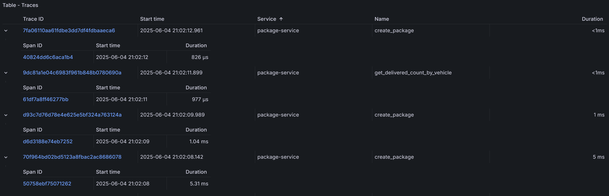

- dla ***vehicle-service***:
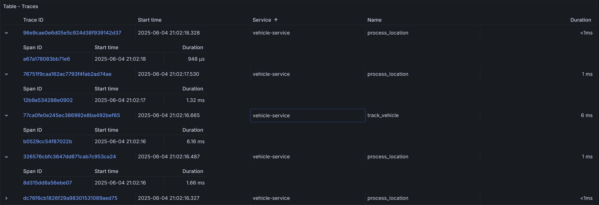

Po kliknięciu w ID wybranego śladu można podglądnąć informacje dotyczące cyklu życia wybranego żądania. Przykładowo, dla procedury **trackVehicle** z serwisu ***vehicle-service*** możemy podglądnąć informację m.in. o ID pojazdu oraz przesyłane koordynaty tego pojazdu:

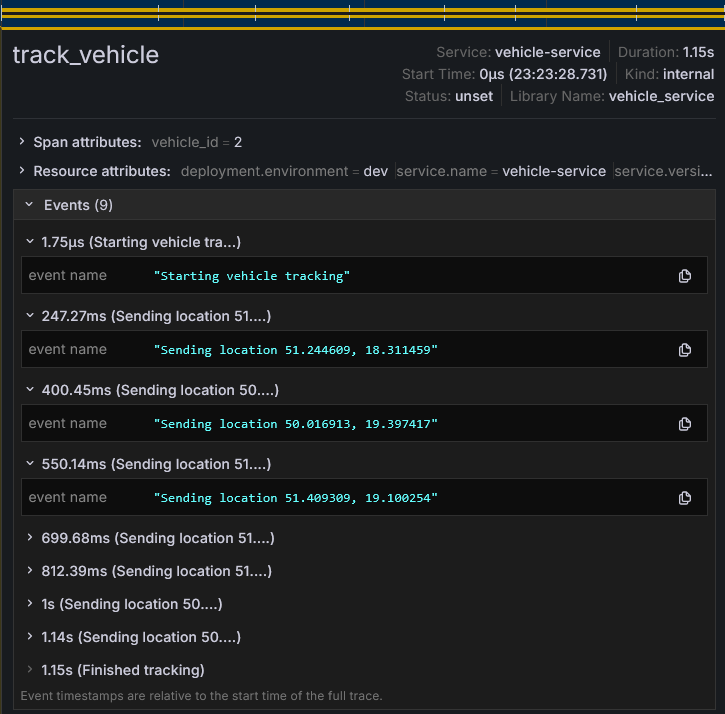

#### Przykłady metryk:

- metryka ***create_package_duration_seconds_sum*** - pozwala śledzić sumę czasów wszystkich zarejestrowanych wywołań procedury **createPackage**:

   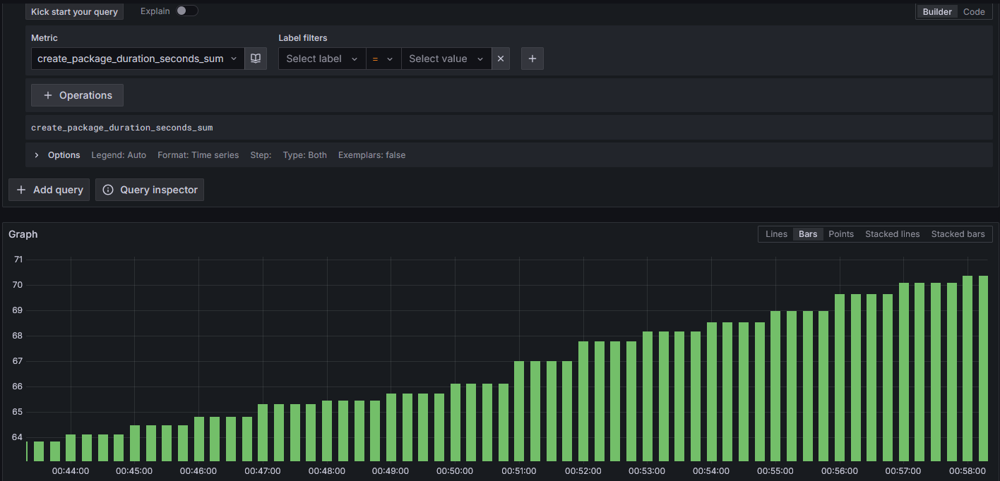

   Za pomocą prostych zapytań, możemy w szybki sposób wyświetlić np. histogram średniego czasu wykonania owej procedury:

   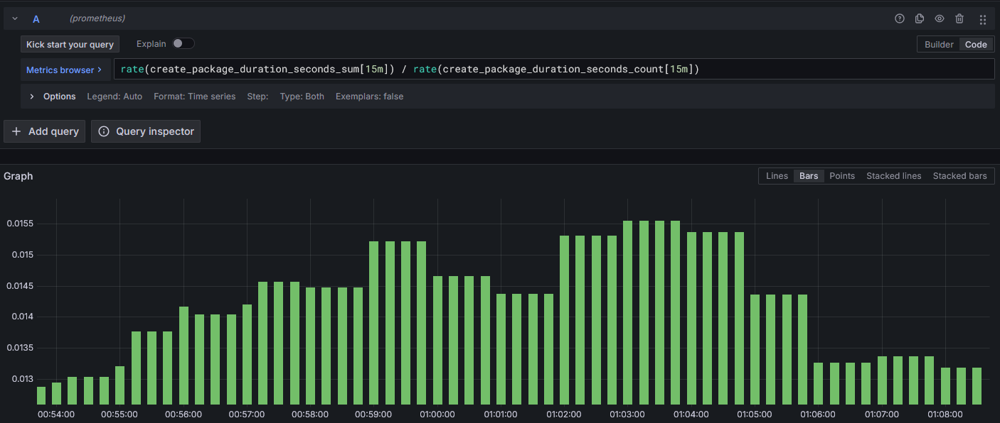

- metryka ***package_service_latency_ms_milliseconds_sum*** - pozwala śledzić sumę czasów odpowiedzi wywołań procedury **getDeliveredCountByVehicle** z ***package-service*** w procedurze **getPackagesDeliveredBy** z ***vehicle-service*** (tudzież opóźnienie zewnętrznego wywołania gRPC):

   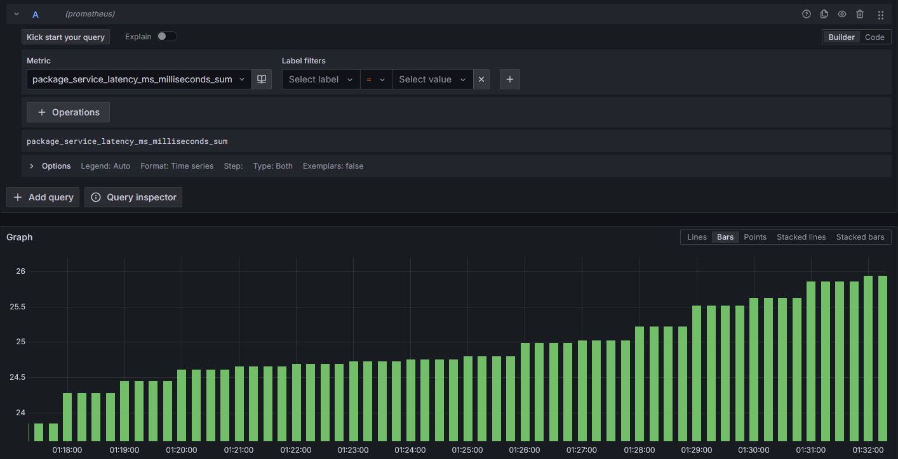

   Tutaj w analogiczny sposób jak ostatnio możemy wyświetlić pomocnicze wykresy:

   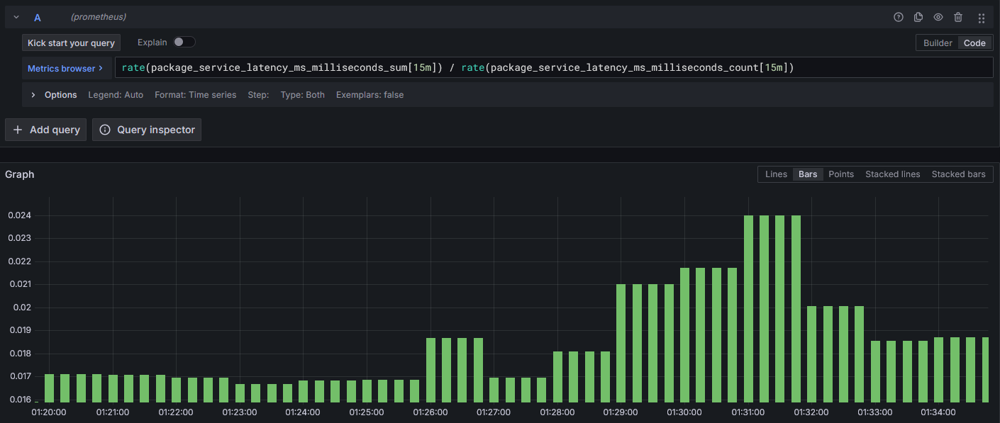

- metryka **delivered_packages_total** - pozwala śledzić całkowitą liczbę dostarczonych paczek dla wybranych pojazdów:

   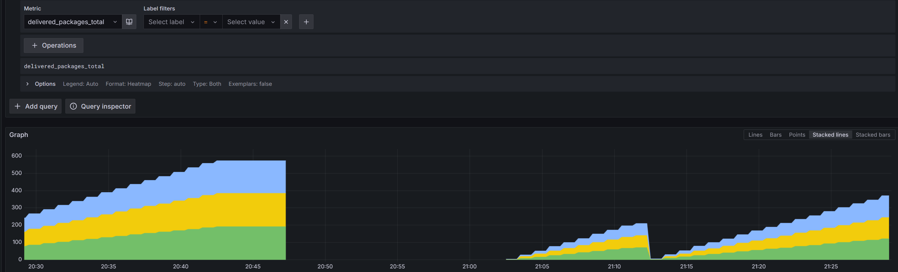

   Możemy sobie na przykład wybrać konkretny pojazd oraz wyliczyć przyrost wartości w ustalonym oknie czasowym, np. 10 minut:

   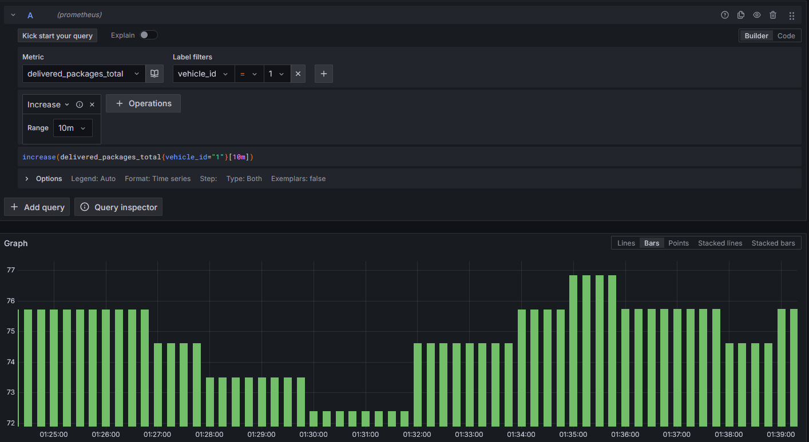

   Na podstawie takiej metryki można na przykład ustawić alerty, badające czy czasami serwis nie przestał działać.

- metryka **locations_processed_total** - liczy całkowitą liczbę lokalizacji przetworzonych w wywołaniach procedury **sendLocation** z ***vehicle-service***:
   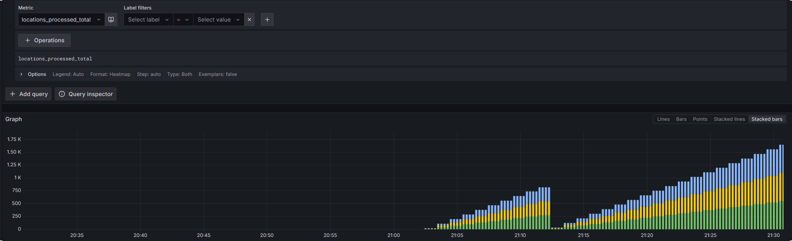


- metryka **update_packages_requests_total** - pokazuje ile sumarycznie razy rozpoczęta została aktualizacja paczek (tudzież ile razy została wywołana procedura **updatePackages** z ***package-service***):

   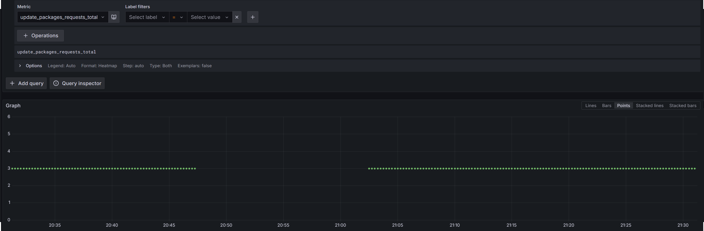

#### Przykłady logów:

- logi z ***package-service***

   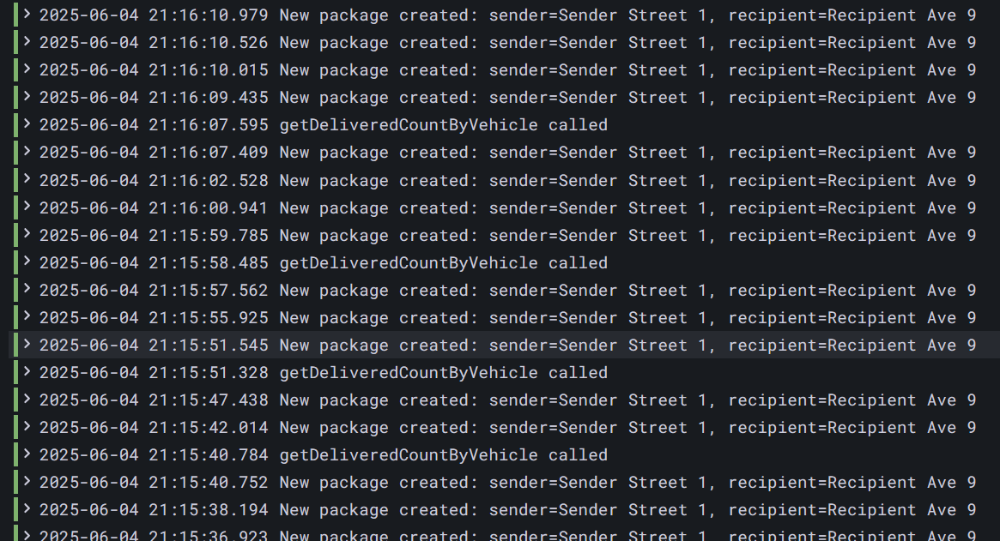

- logi z ***vehicle-service***

   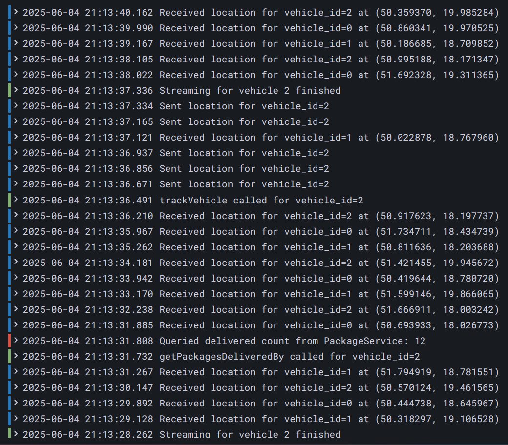

Po kliknięciu w wybrany log można zobaczyć informacje dotyczące pól zawartych w tym logu:

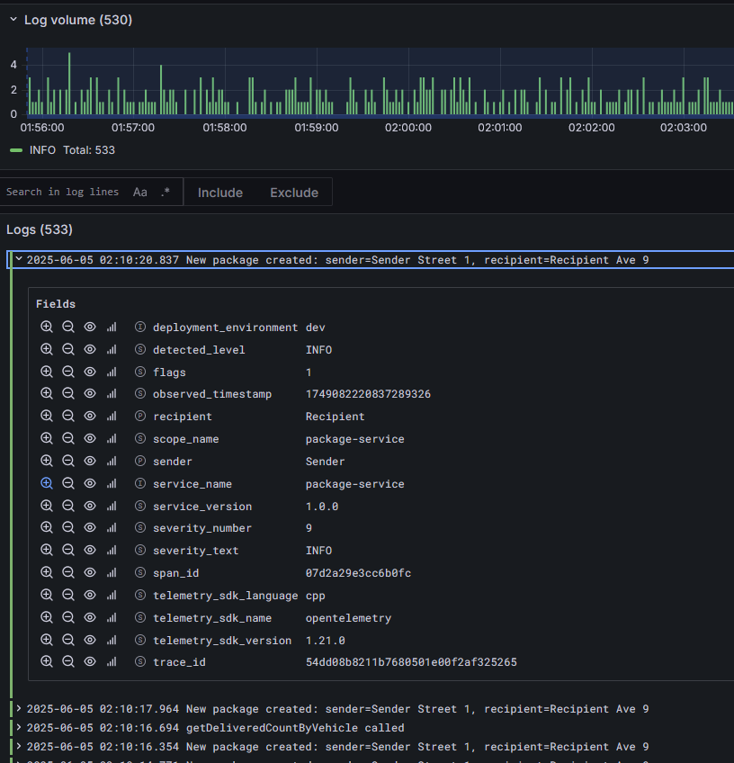


## Wykorzystanie AI w projekcie

(IZ) AI został używany w projekcie głównie w dwóch celach - ulepszenie dokumentacji i debugowanie logów.
```
Find what is wrong with this log.
<For example log from vechicle-service with some kind of error>
```

(AW) W procesie tworzenia projektu, korzystałem z AI głównie gdy pojawiały się problemy, których powodu nie byłem w stanie samemu zrozumieć. Przykładowo, we wczesnej fazie projektu napotkałem problemy podczas kompilacji plików *.cpp* - wiedziałem, że Makefile działał poprawnie u innych, więc założyłem że problem był związany z systemem MacOS.
```
<Błąd z konsoli>
<Fragment Makefile z komendami kompilacji z flagami>
U mnie na Macu wyrzuca taki błąd, na Linuxie działa w porządku. W czym problem?
```
W odpowiedzi dostałem przydatne wskazówki nt. co muszę konkretnie naprawić w plikach konfiguracyjnych w systemie używanych przez pkg-config, a także jakie flagi dodać do kompilacji w moim przypadku.

(MP) Wykorzystałem AI głównie do naprawiania błędów w kodzie.
```
Powiedz mi w czym problem i jak to naprawić.
<błąd>
```
Czasem niestety AI się myliło, i próbowało używać klas które nie istniały, np. DoubleCounter zamiast Counter<double>.

(PC) AI częściowo pomogło mi w pisaniu plików YAML do deploymentów. Pytałem między innymi o to jak zintegrować Prometheusa z Grafaną, konfiguracja wygenerowana przez AI nie była jednak poprawna.
```
Mam prometheusa zainstalowanego przez helm. Jak mogę ustawić żeby scrapował dane z otel-collectora>
(deploy się nazywa simplect-collector i są dostępne na porcie 9464)
extraScrapeConfigs:
  - job_name: 'otel-collector'
    static_configs:
      - targets: ['simplest-collector.default.svc.cluster.local:9464']
```
A poprawna konfiguracja wygląda tak:
```
serverFiles:
  prometheus.yml:
    scrape_configs:
      - job_name: 'otel-collector'
        static_configs:
          - targets:
              - simplest-collector.default.svc.cluster.local:9464
```

#### Podsumowanie

W ogólności w tym projekcie sztuczna inteligencja pomogła nam w szybszej realizacji projektu, ale często myliła się w szczegółach, co skutkowało stratą czasu dla pewnych elementów. W internecie mało jest przykładów integracji C++ z gRPC oraz OpenTelemetry, przez co AI nie było dobrze wytrenowane do tych zadań.

## Podsumowanie i wnioski

Niniejszy projekt stanowi kompletny przykład systemu mikroserwisowego, który integruje:
- konteneryzację przy użyciu Dockera,
- zarządzanie cyklem życia usług poprzez Kubernetesa,
- obserwowalność (OpenTelemetry, Prometheus, Grafana, Loki, Tempo),
- oraz podejście Infrastructure as Code.

Dzięki modularnej strukturze i wykorzystaniu otwartych standardów projekt między innymi:
- jest łatwy do wdrożenia i rozwijania,
- umożliwia szybką diagnostykę działania systemu za pomocą metryk, logów i śladów.

**Wnioski:**
- Zastosowanie mikroserwisów znacząco ułatwia skalowanie i niezależny rozwój komponentów.
- Monitoring i logowanie zdarzeń zwiększa niezawodność systemu i skraca czas diagnostyki błędów.
- Podejście IaC zapewnia powtarzalność wdrożeń i minimalizuje błędy ludzkie.
- Projekt może stanowić solidną bazę do dalszego rozwoju – np. w kierunku automatycznego skalowania czy zaawansowanej analityki.

## Odniesienia

- [gRPC website](https://www.cncf.io/projects/grpc/)
- [OpenTelemetry website](https://www.cncf.io/projects/opentelemetry/)
- [Grafana tools website](https://grafana.com/)
- [OTel and Loki in Grafana](https://grafana.com/docs/loki/latest/send-data/otel/)
- [Protobuf website](https://protobuf.dev/)
